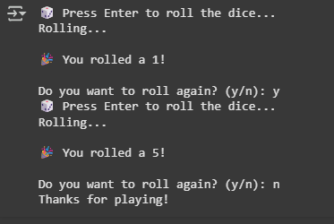

# 🎲 Dice Roller Simulator

A beginner-friendly Python project that simulates rolling a six-sided die. When the user presses Enter, the program displays a suspenseful rolling animation and randomly outputs a number from 1 to 6.

## 💡 Features

- Random number generation between 1 and 6
- ASCII suspense animation before showing the result
- Option to roll again or exit
- Clear and clean terminal interface

## Working


## 🛠️ Requirements

- Python 3.x

## 🚀 How to Run

1. Clone this repository or download the `dice_roller.py` file
2. Open your terminal and navigate to the project folder
3. Run the script:

```bash
python dice_roller.py
